# Bayes with coin flips

## Bayes' theorem

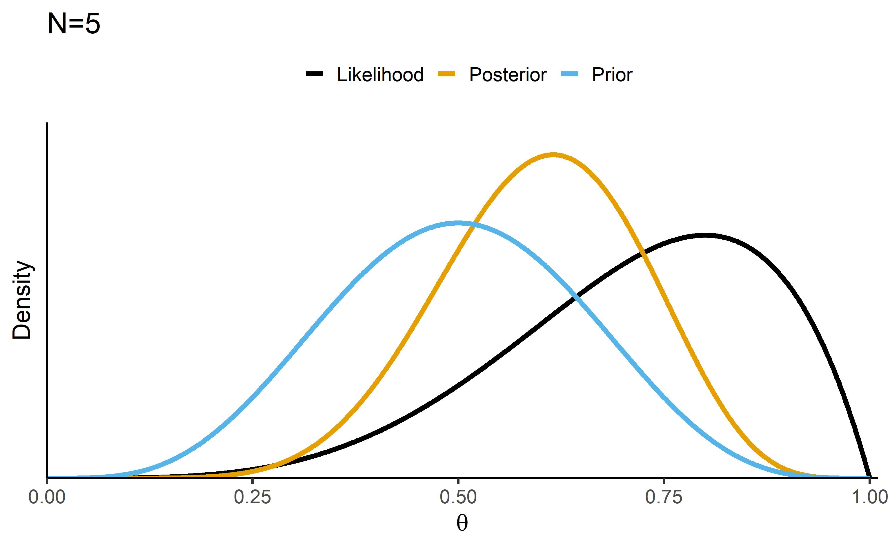

## Bayesian updating

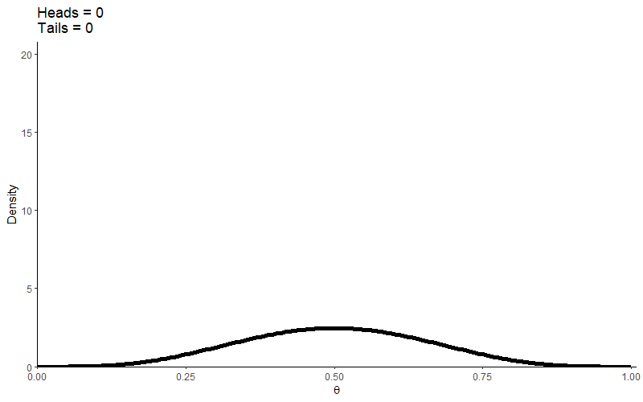

# Clustering

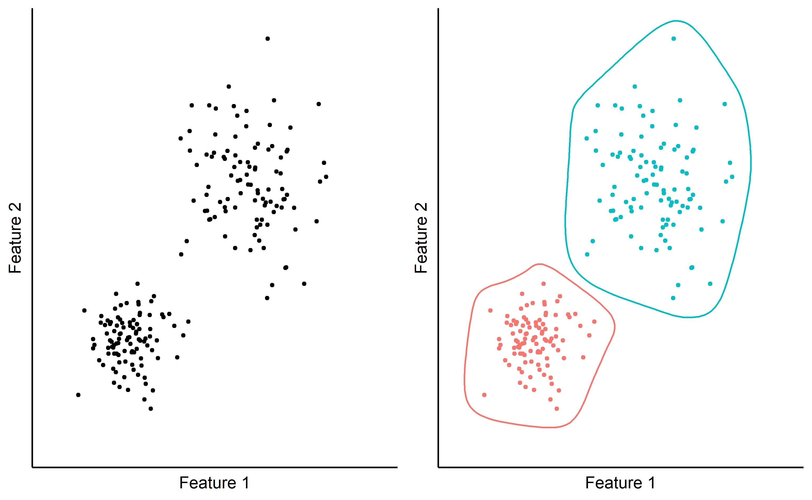

# Forward chaining

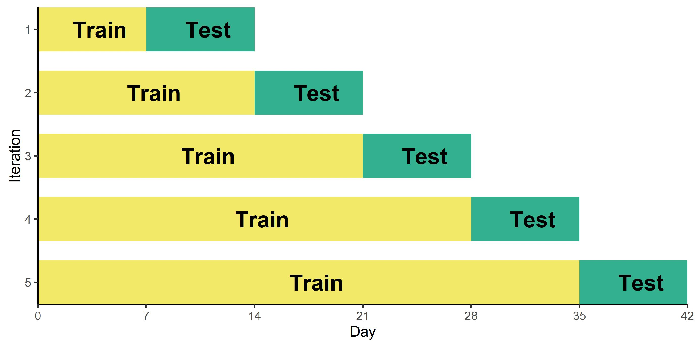

# Gaussian distribution

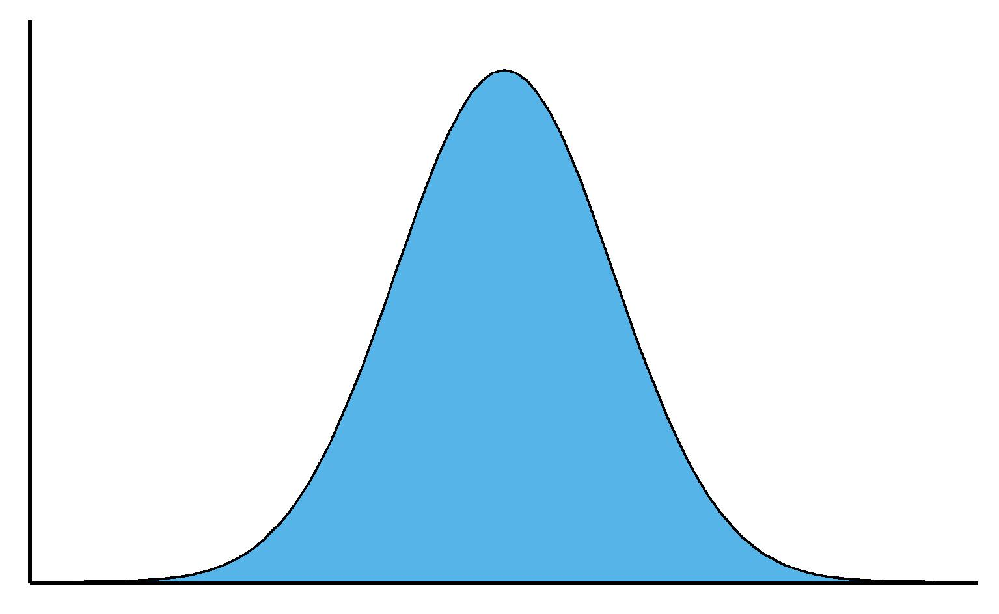

# Metrics for probabilistic forecasts

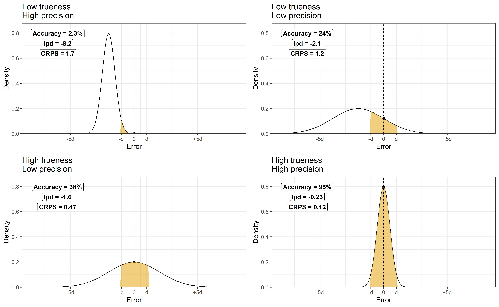

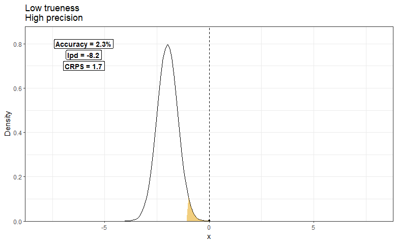

# Ordered logistic distribution

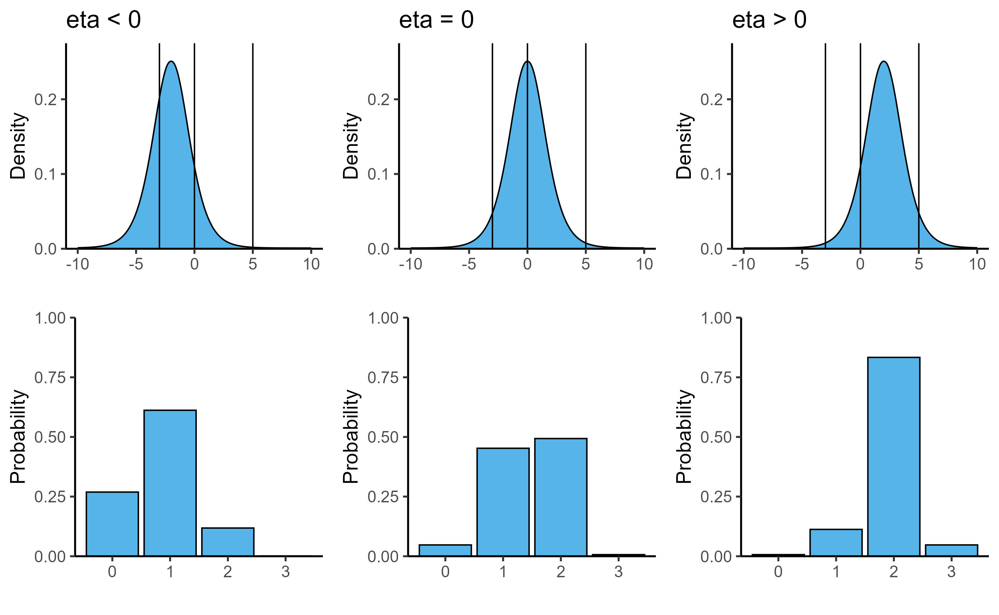

# Prediction "xkcd" style

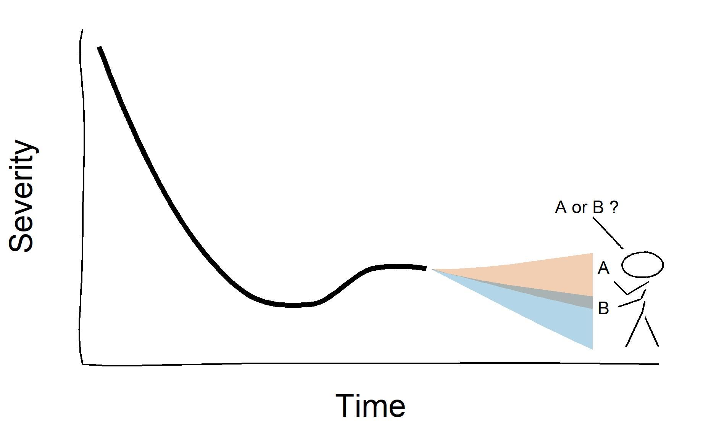

# Ranked Probability Score

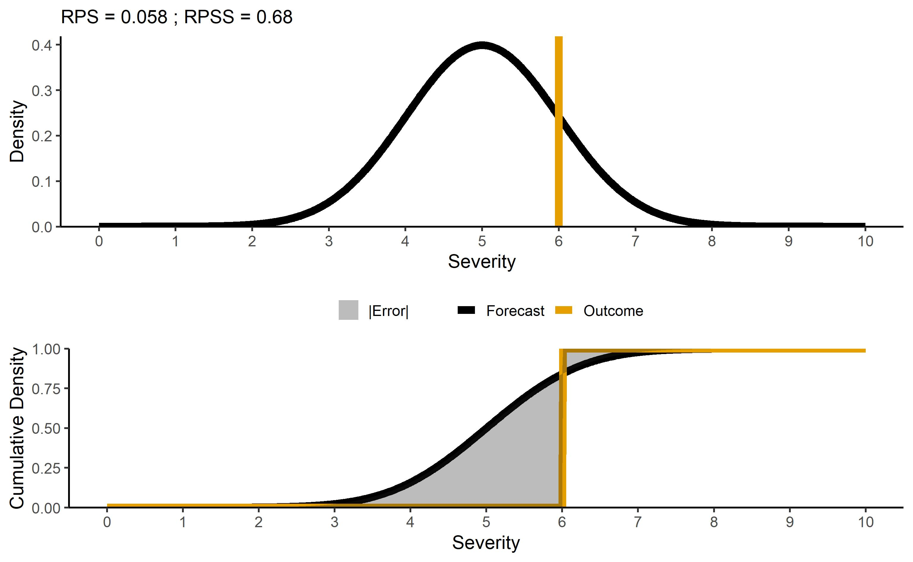

# Sampling a distribution

## Grid sampling

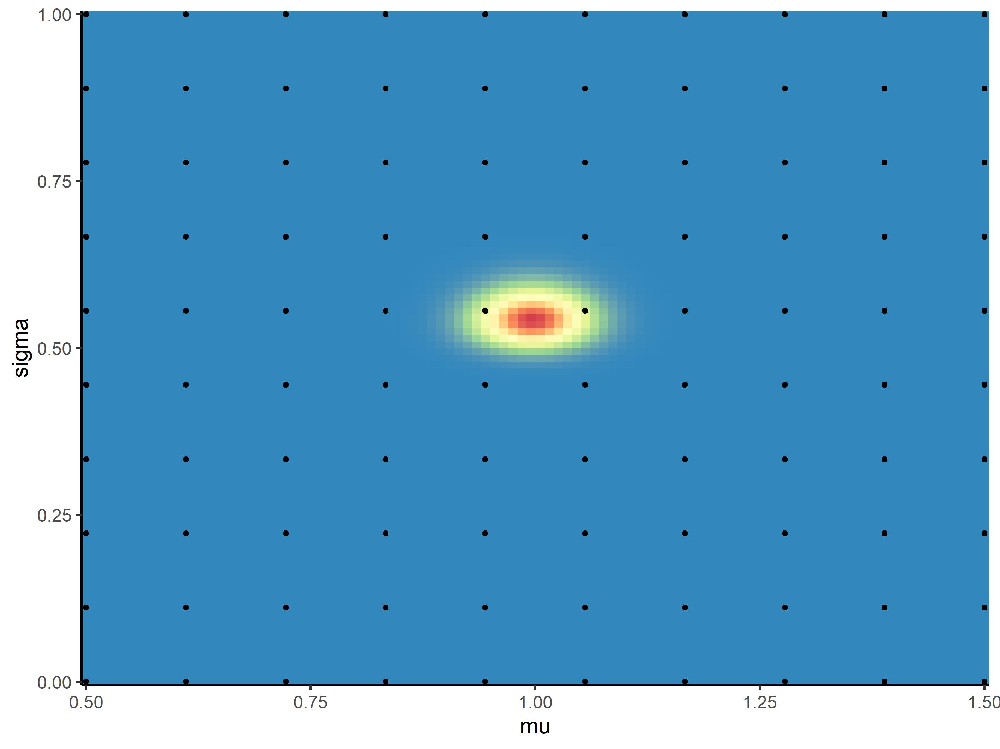

## MCMC sampling

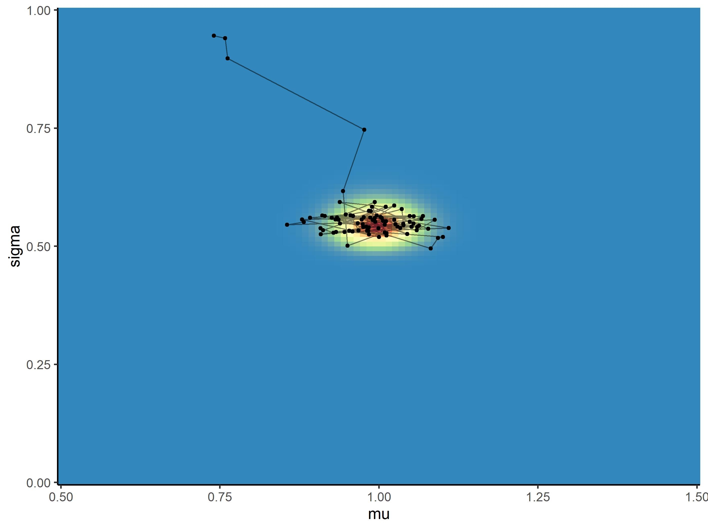

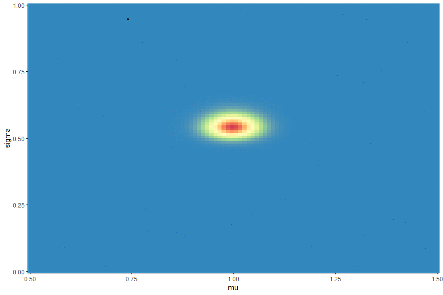

# Stickman

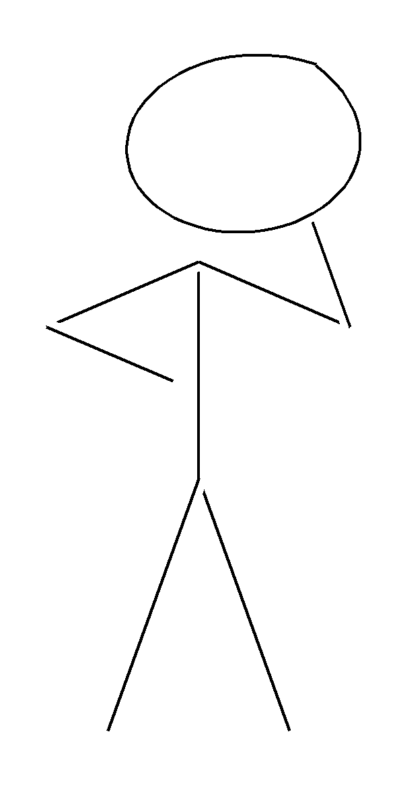
